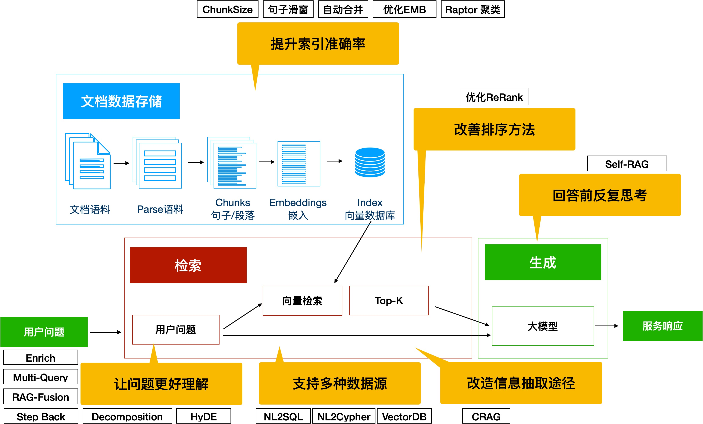

# 基于多模态大模型的短视频画面配乐

## 学习如何使用 Github 写作完成项目
在开始与其他同学使用 Github 协同工作之前，请确保熟练使用 Github 的协同编程。如果不了解，请先学习[该笔记](./cowork-with-github.md)。

## 项目节点
0. 确定小组 Leader，Leader 负责推进项目进度、把控项目方向（项目开发总周期两个月）。
1. 确定多模态大模型的短视频画面配乐能力边界（短视频画面配乐匹配画面的时长，能够调整的范围，能否增加关键词来制定风格等）
2. 收集数据(2周)，音乐数据下载，google 中搜索【无版权音乐】，使用爬虫下载。或使用 suno/MusicGen 等模型生成。
   - 开源数据
   - 私有数据
   - 爬虫数据
   - 其他数据
3. 确定技术路线并开发，是基于 RAG 还是基于模型或其他方案（3周）
   - 基于 RAG，采取检索方案，让多模态大模型（例如GPT-4o）基于短视频画面内容理解语音，使用基于音乐的 RAG 模型检索召回
   - 基于大模型训练，训练多模态音乐-文本大模型
   - 混合方案
   - ...
4. 制作博文写手测试样本（1周）
5. 测试并优化（2周）
   - 提示词优化
   - 基于 RAG 的优化
   - 大模型训练优化
6. 基于 gradio 或其他 UI 制作前端对话页面（1周）
7. 写总结文档，反思项目中的困难、解决方法、学习到什么（1周）
   

